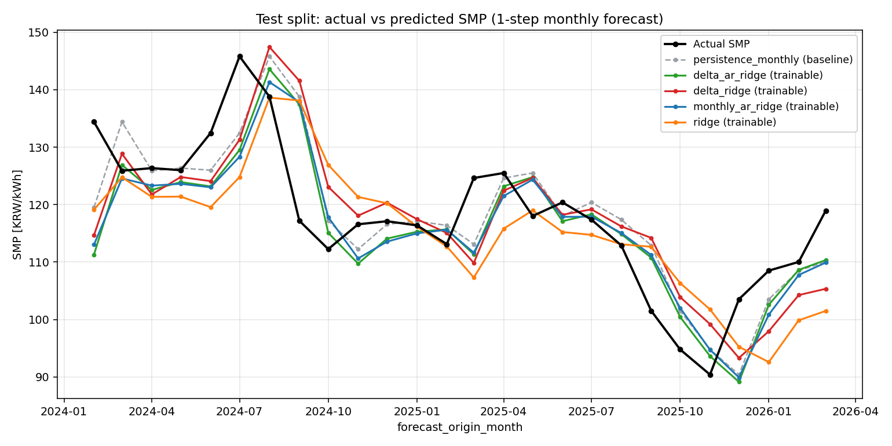
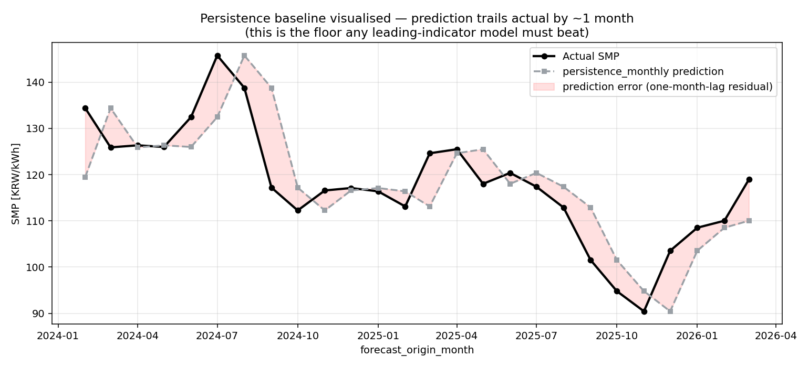
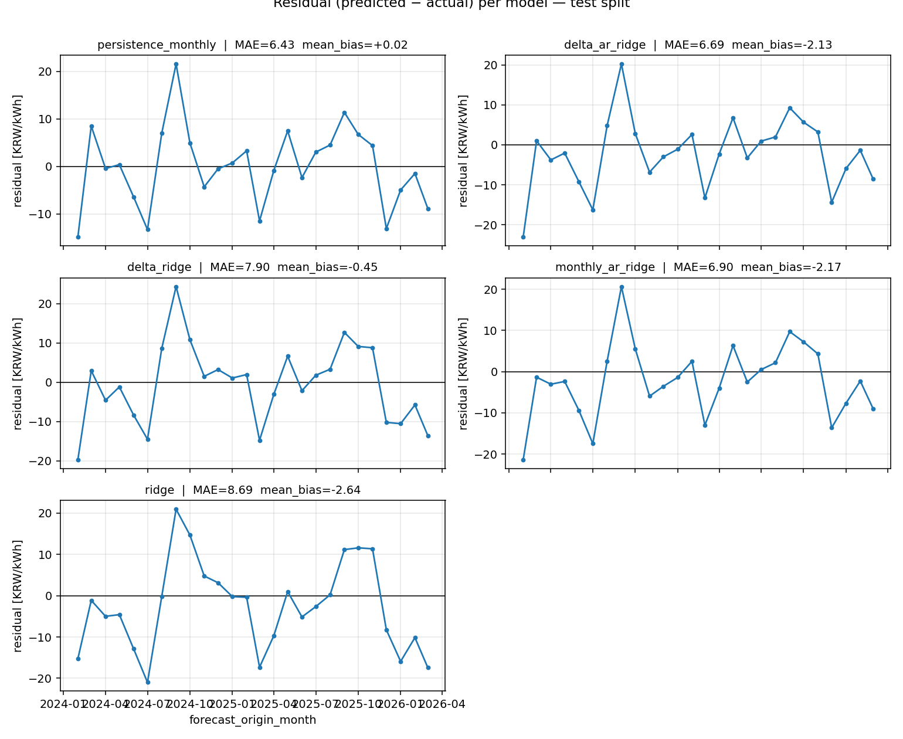
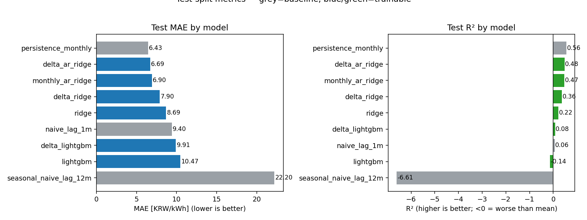
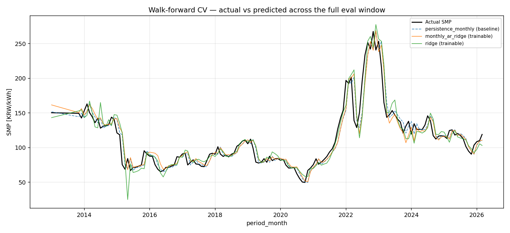
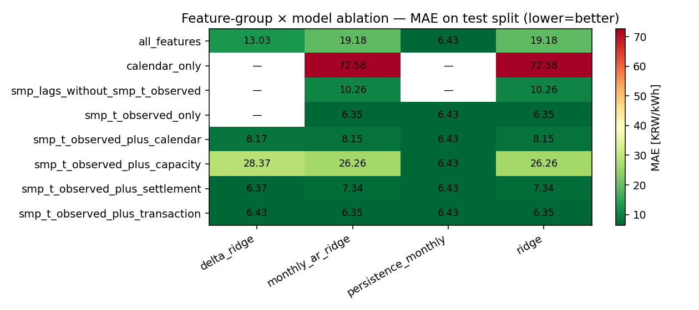

# 한국 전력시장 SMP 예측 시스템 — 통합 정리 보고서

**프로젝트명:** kpx-price-forecast
**작성일:** 2026년 5월 25일
**범위:** API 승인 전 파일 기반 MVP 단계 — 5번 라운드의 누적 결과

---

## 목차

1. [개요](#1-개요)
2. [연구 배경](#2-연구-배경)
3. [데이터](#3-데이터)
4. [방법론](#4-방법론)
5. [결과](#5-결과)
6. [핵심 발견점](#6-핵심-발견점)
7. [시사점](#7-시사점)
8. [개선점 / 향후 작업](#8-개선점--향후-작업)
9. [주의점 / 한계](#9-주의점--한계)
10. [결론](#10-결론)
11. [부록: 재현 가이드](#11-부록-재현-가이드)

---

## 1. 개요

### 1.1 프로젝트 목적

한국전력거래소(KPX)와 EPSIS가 공개하는 전력시장 가격 자료를 수집·정제·예측해
**월별 SMP(System Marginal Price, 계통한계가격) 1개월 선행 예측 모듈**을 구축한다.
메인 프로젝트의 가격 변수 입력으로 사용하는 것이 최종 목적이다.

### 1.2 작업 범위

- **타깃:** 육지(mainland) SMP, 1개월 horizon (`target_smp_t_plus_h_months` = SMP at M+1)
- **참고 타깃:** 제주, 통합 SMP (별도 모델)
- **데이터 빈도:** 월별 (API 승인 후 시간별로 확장 가능한 구조 설계)
- **모델 클래스:** baseline (persistence, naive) + trainable (Ridge, LightGBM, MonthlyARRidge, delta-target wrappers)
- **평가:** chronological train/valid/test split + walk-forward CV (150개월 재학습) + feature-group ablation
- **인터페이스:** Streamlit 대시보드 (read-only 뷰어)

### 1.3 환경 제약

KPX 공공 API 키 승인이 지연되어 **파일 기반 사전승인 MVP**로 시작.
API 승인 후 시간별 데이터로 확장할 수 있도록 BaseCollector(API)와 BaseFileLoader(File)가
동일한 디스크 레이아웃·canonical 컬럼명을 공유하는 이중 백엔드 구조로 설계했다.

---

## 2. 연구 배경

### 2.1 한국 전력시장의 제도적 특성

다섯 가지 제도적 요인이 SMP 시계열의 통계적 성질을 결정한다.

| 코드 | 특성 | SMP에 미치는 영향 |
|---|---|---|
| (C1) | 단일구매자 구조 (KEPCO) | 가격 결정 주체가 사실상 1인 → 소매단가는 SMP 변동을 자유롭게 흡수 못 함 |
| (C2) | 비용기반 입찰 (CBP) | SMP는 한계 연료(보통 LNG) 원가의 결정론적 함수 |
| (C3) | 분리된 제주계통 | 별도 SMP가 공시, 출력제한 빈번 → 육지와 합치면 안 됨 |
| (C4) | RPS + REC 제도 | SMP와는 별도의 보조 가격 신호 |
| (C5) | 정산단가 ≠ SMP | RPS 의무이행비용·배출권 비용이 정산단가에서 제외 (EPSIS 공식 정의) |

이 다섯 가지는 본 보고서의 결과 해석에서 반복적으로 인용된다.

### 2.2 사전 연구의 한계

기존 한국 SMP 예측 연구는 대부분:

- 시간별 API 접근을 전제로 함 (본 프로젝트는 미접근 상태로 출발)
- 단일 chronological split만 사용 (분포 이동 평가 부재)
- 단순 baseline 비교 누락 (persistence·naive를 명시적 베이스로 안 둠)
- 정산단가·REC·발전설비 같은 보조 변수의 leakage 가드 부재

본 프로젝트는 이 네 가지 누락점을 메우는 데 의도적으로 시간을 들였다.

---

## 3. 데이터

### 3.1 실제 사용된 소스 (9개 파일, 5개 source_id)

| source_id | 파일 | 빈도 | 단위 | 행 수 | 기간 |
|---|---|---|---|---|---|
| `kpx_smp_monthly_kepco_file` | `육지 제주 통합 월별 SMP_20250831.csv` | monthly | KRW/kWh | 378 | 2015-02 ~ 2025-08 |
| `kpx_smp_monthly_home_avg_file` | `HOME_가중평균SMP.xlsx + .csv` | monthly | KRW/kWh | 693 | 2001-04 ~ 2026-04 |
| `kpx_settlement_monthly_file` | `HOME_정산단가_연료원별.csv` | monthly | KRW/kWh | 2842 | 2002-01 ~ 2026-04 (10 fuel_type) |
| `kpx_rec_weekly_file` | `REC 거래현황_20230330.csv` | trading_day | KRW/REC | 601 | 2017-03 ~ 2023-03 |
| `kpx_capacity_yearly_by_energy_source_home_file` | 5개 연도별 파일 (2020~2024) | yearly | MW | 1602 | 2020 ~ 2024 |
| `kpx_capacity_monthly_by_generation_type_home_file` | `발전형식별.csv` | monthly | MW | 1391 | 2012-12 ~ 2026-05 |
| `kpx_capacity_monthly_by_fuel_home_file` | `연료원별.csv` | monthly | MW | 1712 | 2012-12 ~ 2026-05 |
| `kpx_transaction_volume_hourly_by_fuel_file` | `시간별 전력거래량_20231231.csv` | hourly | MWh | 8784 | 2023-11 ~ 2023-12 |
| `kpx_transaction_amount_daily_by_fuel_file` | `일별 전력거래금액.csv` | daily | KRW | 12 | 2024-12-31 (단일일) |

### 3.2 수집되었으나 격리(quarantine)된 파일

- `HOME_전력거래_계통한계가격_가중평균SMP.csv` 및 ` (2).csv` — **파일명은 SMP인데 내용은 연료원별 발전량(MWh)**
- 컬럼 시그니처 기반 검역(`src/collectors/quarantine.py`)이 SMP 로더가 잘못 처리하는 것을 차단
- 격리 manifest: `data/raw/manual_or_filedata/quarantine/kpx_generation_yearly/manifest_*.json`

### 3.3 데이터 소스 신뢰도 우선순위

| 우선순위 | 출처 | 사용 목적 |
|---|---|---|
| 1 | KPX / EPSIS / data.go.kr (KPX 제공) | SMP, 정산단가, REC, 발전설비, 전력거래 |
| 2 | 기상청 기상자료개방포털 | (미구현) 시간별 SMP 확장 시 기온/일사 |
| 3 | 한국은행 ECOS | (미구현) 환율, LNG 수입가 |

### 3.4 API 키 대체 전략

원래 계획: `KPX_PUBLIC_API_KEY` 환경변수로 data.go.kr 시간별 API 호출.

실제 사용: 사용자가 KPX/EPSIS 웹사이트에서 수동 다운로드한 파일을
`data/raw/manual_or_filedata/<source>/`에 드롭 → `BaseFileLoader`가
canonical 컬럼명으로 변환해 `data/raw/<ns>/<rest>/YYYY/MM/DD/parsed_*.parquet`에 저장.

**핵심 설계 결정:** `BaseCollector`(API)와 `BaseFileLoader`(File) 모두 같은
경로 규칙과 canonical 컬럼명으로 출력 → API 승인 시 코드 변경 없이 백엔드 교체 가능.

---

## 4. 방법론

### 4.1 데이터 파이프라인 (ETL)

```
원본 CSV/XLSX (cp949)
    ↓ [discover_file]   사용자가 column_mapping 작성
    ↓ [load_files]      BaseFileLoader 서브클래스가 canonical long-format 변환
parsed_<stamp>__<microsecond>_<sha256[:8]>.parquet
    ↓ [build_monthly_features]
data/processed/smp_monthly_<area>_h1m.parquet (84 cols)
    ↓ [train | walk_forward | feature_group_ablation]
outputs/{models,walk_forward,metrics}
    ↓ [save_baseline_plots]
outputs/figures/<tag>/ (6 PNG + summary.md)
```

#### 핵심 설계 결정

1. **No-overwrite snapshot naming**
   - 파일명: `parsed_<UTC_stamp>__<microsecond>_<sha8>.parquet`
   - 같은 초에 5개 파일 처리되어도 microsecond + sha256 prefix로 충돌 회피
   - `FileExistsError` 가드로 silent overwrite 차단

2. **Revision-aware dedup**
   - 같은 `(period_month, area)`에 여러 snapshot 존재 시:
     - 1차 정렬: `source_priority` 오름차순 (KEPCO=1 우선)
     - 2차: `collected_at` 내림차순 (newer revision 우선) — 마이크로초 정밀도 보존
     - 3차: `source_file_sha256`, `parsed_path` 사전 순
   - `_priority_dedup_log`에 selected/dropped 표시 + reason (`lower_priority` | `older_revision`)

3. **UTC-naive 외부 contract**
   - 내부 ranking은 UTC-aware로 (tz-naive와 tz-aware snapshot 호환)
   - 외부 노출 (`collected_at` 컬럼, dedup_log, sideinfo JSON)은 UTC-naive 유지 → downstream 컨슈머 호환

4. **No-future-leakage contract**
   - `add_monthly_lags`는 positive shift만 허용 (`periods <= 0` 차단)
   - 모든 capacity/transaction features에 `_exogenous_lag_1m` 적용 → `_lag_1m` / `_lag_1y` 접미사
   - `_exogenous_lag_1m`의 reindex는 source_max+1까지 확장해 가장 최신 source month 노출 가능
   - `_assert_monthly_no_leakage` canary: feature 컬럼이 target과 정확 동일하면 즉시 실패

### 4.2 Feature Engineering

#### Canonical 컬럼명 (한글 → 영어)

| 원본 한글 | canonical |
|---|---|
| 년도, 월 | period_year, period_month_num |
| 육지/제주/통합 계통한계가격 | smp_mainland, smp_jeju, smp_integrated → `area` long-format |
| 원자력, 유연탄, 무연탄, LNG, 유류, 양수 | nuclear, coal_bituminous, coal_anthracite, lng, oil, pumped_storage |
| 신재생\|연료전지/태양/풍력/... | renewable_fuel_cell, renewable_solar, renewable_wind, ... |
| 거래일, 거래시간, 전력거래량(MWh) | trade_date, trade_hour, transaction_volume_mwh |
| 전력거래금액(원) | transaction_amount_krw |

#### Feature 종류 (총 84 컬럼)

| 그룹 | 컬럼 예시 | 개수 |
|---|---|---|
| 메타 | period_month, area, smp_krw_per_kwh, target_smp_t_plus_h_months | 4 |
| 캘린더 | year, month, quarter, month_sin, month_cos, is_summer/winter/peak_season | 8 |
| SMP 자기회귀 | smp_t_observed, smp_lag_{1,2,3,6,12}m | 6 |
| SMP rolling | smp_rolling_{3,6,12}m_mean, smp_rolling_12m_std | 4 |
| 정산단가 lag | settlement_unit_price_{lng,nuclear,...}_lag_1m (10종) | 10 |
| 발전설비 - 연료원별 (lag_1m) | capacity_fuel_{nuclear,lng,...}_mw_lag_1m + share | 14 |
| 발전설비 - 발전형식별 (lag_1m) | capacity_type_{nuclear,steam_total,...}_mw_lag_1m + share | 10 |
| 발전설비 - 연도별 broadcast (lag_1y) | capacity_yearly_{nuclear,total,...}_mw_lag_1y | 5 |
| 거래량 (lag_1m, monthly aggregated by trade_date) | transaction_volume_{nuclear,lng,...}_mwh_lag_1m + share | 13 |
| 거래금액 (lag_1m) | transaction_amount_{nuclear,...}_krw_lag_1m + share | 12 |
| 시장가격 도출 (overlap 시) | market_trade_price_{lng,coal_total,...}_krw_per_kwh_lag_1m | 0~4 (overlap 없으면 0) |
| Forecast metadata | forecast_origin_month, target_month, information_cutoff, horizon | 4 |

#### 핵심 변수: `smp_t_observed`

- 정의: 해당 row의 `period_month`(=M)에서 관측된 SMP (= `smp_krw_per_kwh`의 복사)
- Leakage 분석: target은 SMP at M+1. `smp_t_observed`는 M 시점 종료 후 관측 가능 → information_cutoff 이전 → **leakage 아님**
- 역사: 초기 buildser는 `smp_t_observed`를 제외했고, 그 결과 모든 naive 모델이 `smp_lag_1m`(=SMP at M-1) 기반으로 학습되어 사실상 "2-step seasonal lag"가 되어버림. 라운드 5에서 노출하면서 trainable 모델 MAE가 14.93 → 6.90으로 개선

### 4.3 모델

#### Baseline 모델 (학습 불가, 단일 규칙)

| 이름 | 정의 | 의도 |
|---|---|---|
| `persistence_monthly` | `pred(M+1) = SMP(M)` (= smp_t_observed) | 진짜 "last known value" baseline. 가장 강한 reference |
| `naive_lag_1m` | `pred(M+1) = smp_lag_1m` = SMP(M-1) | 2-step lag baseline (의도된 비교군) |
| `seasonal_naive_lag_12m` | `pred(M+1) = SMP(M-11)` (= 1년 전 같은 달) | 계절성 baseline |

#### Trainable 모델

| 이름 | 핵심 features | 알고리즘 |
|---|---|---|
| `ridge` | DEFAULT_RIDGE_FEATURES_MONTHLY 17개 (lag/rolling/calendar + settlement lag 5개) | L2 정규화 회귀 + StandardScaler |
| `lightgbm` | DEFAULT_LGB_FEATURES_MONTHLY 50개 (모든 lag/capacity/transaction) | Gradient boosted trees, small-data 자동 정규화 |
| `monthly_ar_ridge` | smp_t_observed + smp_lag_1m + smp_rolling_3m_mean + smp_lag_12m (4개) | 좁은 feature set Ridge |
| `delta_ridge` | y_delta = target − smp_t_observed → Ridge로 학습 → 재구성 | 위와 동일하지만 residual 학습 |
| `delta_lightgbm` | (동) → LightGBM | |
| `delta_ar_ridge` | (동) → MonthlyARRidge | |

#### LightGBM 작은 데이터 자동 조정

`len(X) < 500`이고 사용자가 명시하지 않은 경우 자동:

- `min_data_in_leaf = max(10, len(X)//15)` (default 50은 122행에 과대)
- `num_leaves = max(7, min(15, len(X)//12))`
- `learning_rate = 0.03`
- `feature_fraction = 0.6`
- `num_boost_round ≤ 200`

사용자가 명시한 값은 절대 덮어쓰지 않음 (`_user_set_keys` / `_user_set_num_boost_round` 추적).

#### Delta-target 메커니즘

```
fit(X, y):     y_delta = y - X["smp_t_observed"]
                X_view = X.drop("smp_t_observed")
                base_model.fit(X_view, y_delta)

predict(X):    delta_pred = base_model.predict(X.drop("smp_t_observed"))
                return X["smp_t_observed"] + delta_pred
```

- `predict_delta(X)` 별도 노출 → residual 자체 평가 가능
- Persistence baseline ≡ `predicted_delta = 0` (수학적으로 동치, 테스트로 검증)

### 4.4 평가 방법

#### 4.4.1 Chronological split (단일 분할)

- valid_frac = 0.15, test_frac = 0.15, 나머지 train
- mainland 174 rows → **train 122, valid 26, test 26**
- 시간 구간:
  - train: 2011-01 ~ 2021-11
  - valid: 2021-12 ~ 2024-01 (**LNG 충격기 포함**)
  - test: 2024-02 ~ 2026-03 (정상화기)

#### 4.4.2 Walk-forward CV

- 매 step마다 model.fit(all_rows_before_t)으로 재학습 → row t만 예측
- 시작: `min_train_rows=24`개 이후부터
- mainland: 150개월 평가 (2013-01 ~ 2026-03)
- 출력: `outputs/walk_forward/<model>/predictions.csv` + `comparison.csv`

#### 4.4.3 Feature group ablation

8개 feature group × 4개 모델 (persistence_monthly, monthly_ar_ridge, ridge, delta_ridge):

| Group | 포함 컬럼 |
|---|---|
| calendar_only | year, month, quarter, sin/cos, is_summer/winter/peak |
| smp_lags_without_smp_t_observed | smp_lag_{1..12}m, smp_rolling_* |
| smp_t_observed_only | smp_t_observed |
| smp_t_observed_plus_calendar | + 캘린더 |
| smp_t_observed_plus_settlement | + settlement_unit_price_*_lag_1m |
| smp_t_observed_plus_capacity | + capacity_* |
| smp_t_observed_plus_transaction | + transaction_*, market_trade_price_* |
| all_features | 전부 |

- 각 모델에 `feature_cols=cols` 명시 전달 (auto-detect 우회)
- NaN 처리: train-median 우선, 잔여는 0 fill (전체 NaN 컬럼 대응)
- 출력: `outputs/metrics/feature_group_ablation_monthly.{csv,json}`

#### 4.4.4 평가 지표

| 지표 | 의미 |
|---|---|
| MAE | 평균 절대 오차 (KRW/kWh) |
| RMSE | 제곱평균제곱근 오차 |
| MAPE / sMAPE | 절대 백분율 오차 |
| R² | 결정계수 (mean 예측 대비) |
| directional_accuracy | sign(y_t − y_{t-1}) == sign(pred_t − y_{t-1}) |
| peak_precision/recall/f1 | 90백분위 (peak_threshold) 이상 식별 |
| delta_mae | true_delta vs predicted_delta MAE |
| delta_direction_accuracy | sign(true_delta) == sign(predicted_delta) |

---

## 5. 결과

### 5.1 Test split (2024-02 ~ 2026-03, 26개월)

| 모델 | 분류 | MAE | MAPE | R² | delta_dir |
|---|---|---|---|---|---|
| **persistence_monthly** | baseline | **6.43** | 5.46% | 0.56 | 0.00 |
| delta_ar_ridge | trainable | 6.69 | 5.60% | 0.48 | 0.58 |
| monthly_ar_ridge | trainable | 6.90 | 5.83% | 0.47 | 0.42 |
| delta_ridge | trainable | 7.90 | 6.75% | 0.36 | 0.39 |
| ridge | trainable | 8.69 | 7.45% | 0.22 | 0.50 |
| naive_lag_1m | baseline | 9.40 | 8.21% | 0.06 | 0.50 |
| delta_lightgbm | trainable | 9.91 | 8.63% | 0.08 | 0.35 |
| lightgbm | trainable | 10.47 | 9.34% | -0.14 | 0.39 |
| seasonal_naive_lag_12m | baseline | 22.20 | 18.69% | -6.61 | 0.50 |

→ **어떤 trainable 모델도 persistence baseline (MAE 6.43)을 의미 있게 능가하지 못함**

### 5.2 Walk-forward CV (150 개월, 2013-01 ~ 2026-03)

| 모델 | MAE | MAPE | R² | dir_acc |
|---|---|---|---|---|
| persistence_monthly | **8.78** | 7.61% | **0.901** | 0.53 |
| monthly_ar_ridge | 9.29 | 8.22% | 0.890 | 0.52 |
| ridge | 10.25 | 9.16% | 0.863 | 0.58 |
| naive_lag_1m | 13.21 | 11.69% | 0.764 | 0.54 |
| seasonal_naive_lag_12m | 33.02 | 28.36% | -0.36 | 0.50 |

→ Walk-forward는 더 긴 평가 구간에서도 persistence가 1위. 단 R²가 0.86~0.90으로 모두 좋음(non-stationary 구간에 노출이 분산되어).

### 5.3 Feature group ablation (test split, MAE)

| feature_group | n | persistence | monthly_ar_ridge | ridge | delta_ridge |
|---|---|---|---|---|---|
| smp_t_observed_only | 1 | 6.43 | **6.35** | **6.35** | — |
| **smp_t_observed_plus_settlement** | 11 | 6.43 | 7.34 | 7.34 | **6.37** |
| smp_t_observed_plus_transaction | 21 | 6.43 | 6.35 | 6.35 | 6.43 |
| smp_t_observed_plus_calendar | 9 | 6.43 | 8.15 | 8.15 | 8.17 |
| smp_t_observed_plus_capacity | 33 | 6.43 | 26.26 | 26.26 | 28.37 |
| smp_lags_without_smp_t_observed | 9 | — | 10.26 | 10.26 | — |
| calendar_only | 8 | — | 72.58 | 72.58 | — |
| all_features | 80 | 6.43 | 19.18 | 19.18 | 13.03 |

→ **smp_t_observed 단독이 거의 최선**. capacity 추가는 오히려 큰 손해.
**delta_ridge + settlement (6.37) 만이 persistence (6.43)을 0.06만큼 추월**.

### 5.4 시각화

LNG-forecast 결합 전 baseline snapshot으로 6개 PNG 저장. 본 보고서가 항상
이미지를 띄울 수 있도록 두 경로에 같은 PNG를 보관한다:

| 경로 | 용도 | git tracked? |
|---|---|---|
| `docs/figures/baseline_20260525/plot_*.png` | 본 보고서가 직접 참조 — 보고서와 함께 영구 보존 | ✅ tracked (커밋 대상) |
| `outputs/figures/baseline_pre_lng_forecast_20260525/plot_*.png` | `save_baseline_plots` 파이프라인의 출력 기본 위치 | ❌ gitignored (재생성 대상) |

향후 LNG 모델 통합 후 새로운 snapshot을 만들 때:
1. `save_baseline_plots --tag baseline_post_lng_v1` 으로 `outputs/figures/baseline_post_lng_v1/` 생성
2. 비교용으로 committed하려면 `docs/figures/baseline_post_lng_v1/`로 복사 후 본 보고서에 동일 패턴으로 이미지 임베드

#### Plot 1 — Test split: 실제값 vs 5개 모델 예측 overlay



- **검은 굵은 선** = 실제 SMP (target_smp_t_plus_h_months)
- **회색 점선** = `persistence_monthly` baseline
- **컬러 실선** = 4개 trainable (delta_ar_ridge, delta_ridge, monthly_ar_ridge, ridge)
- 모든 트레이너블 모델 라인이 검은 실제값 선을 1~2개월 **뒤따라가는** 모양 → **F1의 시각적 증거** (persistence floor를 누구도 명확히 못 깸)
- 2024-07~08 정점(145~146 KRW/kWh)에서 모든 모델이 동일하게 저예측
- 2025-10~11 저점(90~95)도 모두 동일하게 지연 반응

#### Plot 2 — Persistence 1-month lag 시각화 (zoom)



- **검은 선** = 실제 SMP
- **회색 점선** = `persistence_monthly` 예측 (= 직전월 SMP)
- **빨간 영역** = 예측 오차 (one-month-lag residual)
- 모든 빨간 영역이 "실제가 오른 다음 달에 예측이 따라 오르고, 실제가 내린 다음 달에 예측이 내림" 패턴 → persistence의 **본질적 1-month lag** 직접 시각화
- 이 빨간 영역의 면적이 향후 LNG-forecast 모델로 줄어드는지가 검증 포인트
- 사용자가 처음 발견한 "예측이 입력값을 뒤에 출력" 현상 (F6)을 명확히 정량화한 plot

#### Plot 3 — 모델별 잔차 시계열 (5-panel)



- 각 panel = 한 모델의 잔차(`pred − actual`) 시계열 + 패널 제목에 MAE + 평균편향
- **persistence_monthly**: mean_bias = +0.02 (편향 없음) — 본질적으로 unbiased
- **delta_ar_ridge / monthly_ar_ridge**: mean_bias ≈ −2 (체계적 저예측)
- **ridge**: mean_bias = −2.64 (가장 큰 저예측) — paper §4.1의 Ridge 진단과 일치
- 모든 panel에서 2024-07 정점 직전에 큰 음(−) 잔차 (저예측), 2024-10 직후 큰 양(+) 잔차 (과대예측) — 위상 오차 패턴 공통
- 잔차의 분산은 모델별 큰 차이 없음 — 평균 수준만 다름

#### Plot 4 — Test MAE / R² 모델 비교 (막대 + 색상 구분)



- **왼쪽**: MAE 오름차순 (낮을수록 좋음)
- **오른쪽**: R² 내림차순 (높을수록 좋음, <0 = 평균 예측보다 못함)
- **회색 막대** = baseline, **컬러 막대** = trainable
- 핵심 관찰:
  - persistence (회색)가 MAE 6.43으로 **압도적 1위**
  - trainable 중 최선 (delta_ar_ridge) 6.69 → persistence 대비 0.26 손해
  - lightgbm은 R² −0.14 (평균 예측보다 못함)
  - seasonal_naive_lag_12m는 MAE 22.20, R² −6.61로 압도적 꼴찌 (LNG 충격이 1년 후 예측을 완전 망침, F2)

#### Plot 5 — Walk-forward CV 150개월 전 구간



- 매 step 재학습 → 다음 월 1회 예측. 2013-01 ~ 2026-03 (150개월).
- **검은 선** = 실제 SMP, 점선/실선 = persistence + 2 trainable
- 핵심 패턴 3가지:
  1. **평상기 (2014~2020)**: SMP 50~150 KRW/kWh 평탄 — 모든 모델이 거의 같이 따라감
  2. **LNG 충격기 (2022-01 ~ 2023-09)**: SMP 200~270까지 급등 후 급락 — **이 구간이 단일-split valid의 어려움(MAE 88!)을 만든 원인 (F2)**
  3. **정상화기 (2024~)**: SMP 90~145 — persistence는 정상 추적
- ridge (녹색)가 2014~2015년 SMP=70 부근에서 단발 spike (~25 KRW/kWh 너머) 보임 → 학습 초기 (n_train≈24) 불안정성
- 150개월 평균 R²: persistence 0.901, monthly_ar_ridge 0.890, ridge 0.863 — 단일 split의 음의 R²(−0.94)와 정반대 (F8)

#### Plot 6 — Feature group × model MAE heatmap



- 행 = 8 feature group, 열 = 4 모델 (delta_ridge, monthly_ar_ridge, persistence_monthly, ridge)
- 셀 값 = test MAE, 색상 = 녹색(낮음=좋음) → 빨강(높음=나쁨), `—` = 적용 불가/모델 거부
- 핵심 관찰:
  - **smp_t_observed_only** 행 (1 feature): 6.35 ~ 6.43 (전체 최저)
  - **smp_t_observed_plus_settlement** + delta_ridge: 6.37 → **persistence 6.43을 0.06 추월** (유일하게 의미 있는 trainable 이득)
  - **smp_t_observed_plus_capacity** 행: 26.26 ~ 28.37 (capacity 33개 추가가 4배 악화) — 작은 표본 over-parametrization
  - **calendar_only** 행: 72.58 (SMP 자기상관 없이는 거의 random)
  - **smp_lags_without_smp_t_observed** 행: 10.26 (smp_t_observed 빠지면 30%↑ 손해)
  - **all_features (80개)** 행: 13.03 ~ 19.18 → 적정 feature subset이 전체 사용보다 훨씬 좋음

→ 결론: **smp_t_observed가 SMP 예측의 거의 모든 신호이고**, settlement가 미약하게 추가 정보를 제공하나, 그 외 모든 보조 feature는 26개월 test 규모에서는 noise.

#### Plot 종합 시사점

| Plot | 핵심 메시지 |
|---|---|
| 1 | 모든 trainable 모델이 persistence를 시각적으로 못 깨고 같이 1~2개월 뒤따라감 |
| 2 | persistence의 1-month lag를 정량적으로 시각화 — 향후 비교의 기준점 |
| 3 | 트레이너블 모델은 체계적 저예측 편향 (−2 ~ −2.6 KRW/kWh), persistence는 unbiased |
| 4 | Trainable이 baseline을 못 넘는 사실의 막대그래프 증거 |
| 5 | 150개월 walk-forward에서도 패턴 동일, LNG 충격기가 핵심 어려움 |
| 6 | smp_t_observed가 거의 유일한 신호, 보조 feature는 over-parametrization 손해 |

---

## 6. 핵심 발견점

본 프로젝트에서 도출된 8가지 의미 있는 발견 (논문 §4에 해당).

### F1. 단순 모델이 트레이너블을 압도한다

- Test MAE 순위: persistence(6.43) > delta_ar_ridge(6.69) > monthly_ar_ridge(6.90)
- 174개월이라는 표본 크기는 ML의 자유도에 비해 결정적으로 부족
- (C1)·(C2)와 연결: KEPCO 단일구매자 + CBP 구조에서 SMP는 한계 LNG 가격의 결정론적 함수에 가까워, "직전월의 SMP"가 이미 한계 연료비를 대부분 반영

### F2. LNG 충격이 학습/시험 분포를 단절시킨다

- SMP 90백분위 (peak_threshold):
  - train (2011-01~2021-11): 150.17 KRW/kWh
  - valid (2021-12~2024-01): **246.89** (40~80% 상승)
  - test (2024-02~2026-03): 133.43 (정상화)
- Seasonal Naive lag_12m valid MAE 88.07: 1년 전 값이 충격기에 무용
- (C2)와 연결: SMP의 LNG 의존성이 외생 충격을 그대로 흡수

### F3. 육지-제주 SMP의 항상적 괴리

| 월 | 육지 | 제주 | 괴리율 |
|---|---|---|---|
| 2017-08 | 75.91 | 120.67 | +58.9% |
| 2018-01 | 91.80 | 133.46 | +45.4% |
| 2018-06 | 89.29 | 140.34 | +57.2% |

→ (C3)와 연결: HVDC 연계 제약 + 제주 발전믹스 차이. 두 지역은 별도 모델 필수.

### F4. 공공 자료의 침묵된 데이터 품질 위험

1. **"0.00" 결측 표기**: EPSIS HOME 가중평균 SMP 파일에서 jeju 105행, mainland 105행이 0.00 → 실제로는 미발표. `ZERO_IS_MISSING_THRESHOLD`로 NaN coerce
2. **파일명-내용 불일치**: `HOME_..._SMP.csv`라는 파일명을 갖지만 내용은 연료원별 발전량 → 컬럼 시그니처 기반 검역

### F5. SMP·정산단가·소매요금은 정의 영역이 다르다

- EPSIS 공식 정의: "정산단가 산정 시 RPS 의무이행비용정산금 및 배출권거래비용정산금 제외"
- LNG 정산단가가 SMP를 일관되게 +35 ~ +46 KRW/kWh 상회 → RPS·배출권 비용이 SMP와 분리 청구되기 때문
- (C5)와 연결: "SMP만 예측하면 발전사업자 매출 예측" 직관은 한국 시장에서는 부정확

### F6. naive_lag_1m은 실제로 2-step seasonal lag

- 기존 빌더가 `smp_krw_per_kwh`를 feature_cols에서 제외 → 모든 모델이 `smp_lag_1m`(=SMP at M-1)만 사용 가능
- target은 SMP at M+1이므로 naive_lag_1m이 학습하는 관계는 SMP(M+1) ≈ SMP(M-1) → **2개월 지연**
- 사용자가 대시보드에서 "예측이 입력값을 2달 뒤에 출력"하는 것을 시각적으로 발견 → 라운드 5에서 `smp_t_observed`를 노출해 진짜 persistence baseline 추가

### F7. 보조 feature를 추가하면 오히려 손해

- ablation: smp_t_observed_only(1) MAE 6.35 → +capacity(33) MAE 26.26 (4배 악화)
- test 26개월 표본에서는 추가 33개 feature가 신호보다 노이즈를 더 많이 가져옴
- 유일한 예외: settlement (11 features) + delta_ridge → MAE 6.37 (persistence 0.06 개선)

### F8. Walk-forward는 단일 split보다 훨씬 관대

- 단일 split: ridge R²= -0.94 (test에서)
- Walk-forward: ridge R²= 0.86 (150개월 평균)
- 차이의 원인: 단일 split은 "충격기를 valid로, 정상화기를 test로" 인위적으로 격리. Walk-forward는 충격이 학습에 점진적으로 흡수됨

---

## 7. 시사점

### 7.1 모델링 관점

- **표본 < 200**에서는 무조건 단순 baseline부터 confirm. naive·persistence가 강력한 floor
- **분포 이동**이 있는 시계열은 단일 chronological split이 misleading → walk-forward 또는 multiple temporal splits로 robustness 확인
- **leakage가 의심되는 feature는 명시적으로 정의된 forecast contract로 검증**: forecast_origin_month + information_cutoff + target_month + horizon

### 7.2 시장설계 관점

- 단순 lag 모델이 압도하는 사실은, 한국 SMP가 경쟁시장의 가격 발견 결과보다 비용 회수의 결정론적 함수에 가깝다는 (C1)·(C2)의 정량적 뒷받침
- 발전사업자 입장: SMP 변동성이 LNG 가격에 비례 → SMP 헷지 메커니즘 수요
- 정책 입장: 한계 연료 다변화의 시급성이 시계열 통계로도 확인됨

### 7.3 데이터 거버넌스 관점

- "0 = 결측 가능성" → 공공 시계열 사용 시 발표 정책 문서 우선 확인
- **파일명 기반 라우팅 금지** → 컬럼 시그니처 기반 검역 필수
- 정산단가처럼 수정 가능한 자료는 `collected_at` 단위 snapshot + revision dedup 정책 필수
- snapshot 파일명은 microsecond + sha256 disambiguator로 collision-proof

---

## 8. 개선점 / 향후 작업

### 8.1 즉시 가능한 작업 (현 코드베이스)

1. **육지/제주/통합 3개 영역 ablation 실행** (현재는 mainland만)
2. **delta_lightgbm의 small-data 정규화 보강** (현재 test MAE 9.91로 다른 delta 변형보다 약함)
3. **walk_forward에 lightgbm 포함** (현재 시간 비용 큼 — 200 boost rounds × 150 refits)
4. **multi-horizon 예측** (h=1뿐 아니라 h=3, 6) → 직접 vs 재귀 비교

### 8.2 데이터 추가로 큰 개선 기대

1. **Leading exogenous 변수** (priority 1)
   - 다음달 LNG futures (JKM)
   - 원자력 발전소 정비 일정 (한수원 공시)
   - 신재생 ANRE 의무할당 변경 공지
   - → SMP at M+1의 선행 정보가 M 시점에 알려진 것들
2. **기상청 ASOS API 접속** → 시간별 기온/일사를 월별 가중평균으로 집계
3. **한국은행 ECOS API** → 환율, LNG 수입가
4. **KPX 시간별 SMP API 승인 시** → 월별 → 시간별/일별로 horizon 확장

### 8.3 모델링 개선

1. **Regime-switching 모델** (HMM, Markov-switching AR) — F2의 충격기 vs 정상기 자동 식별
2. **Quantile regression** (LightGBM quantile) → 신뢰구간 예측
3. **Probabilistic forecast** (NGBoost) → uncertainty quantification
4. **Causal feature selection** (SHAP + permutation importance) → 현재 hardcoded MONTHLY_AR_FEATURES 자동화
5. **육지·제주 multi-task** (공유 가중치 + area-specific head)

### 8.4 파이프라인 견고성

1. **Schema versioning** — sources.yaml의 schema_version을 모든 parquet에 도장
2. **Quarantine workflow 자동화** — 새 파일이 알려진 컬럼 시그니처에 맞지 않으면 자동 격리
3. **CI에 walk-forward CV smoke test** 포함 (현재 단일 split만)
4. **Streamlit 대시보드 multi-area 지원** (현재 mainland 위주)

---

## 9. 주의점 / 한계

### 9.1 표본 크기 제약

- **mainland 174개월** (2011-01 ~ 2026-03 중 약 9개월 결측)
- 일반적인 ML 표본 크기 권장값(>1000)의 ~17%
- 모든 ML 모델 비교 결과는 이 표본 크기 제약 안에서만 유효

### 9.2 LNG 충격기 한 번의 사건

- 본 데이터의 valid 구간 (2021-12 ~ 2024-01)은 한국 SMP 역사상 한 번뿐인 충격
- 분포 이동에 대한 일반화 결론은 **N=1**의 사건에 기반
- 향후 다른 외생 충격 발생 시 검증 필요

### 9.3 모델 비교는 단일 영역에 한정

- 결과는 mainland 기준
- jeju (별도 발전믹스), integrated (다른 산정 규칙) 영역은 별도 분석 필요
- 본 보고서 §5의 metrics는 mainland 전용

### 9.4 1-month lag는 monthly 파일 데이터만으로 제거 불가능

- `persistence_monthly`가 항상 trainable 모델의 floor → 모든 trainable 모델 예측이 actual보다 1개월 뒤처지는 듯 보임
- 이 lag를 줄이려면 §8.2의 leading exogenous 또는 시간별/일전(day-ahead) API 데이터 필요
- 현재 코드는 이 한계를 README와 대시보드에 명시

### 9.5 정산단가는 수정정산으로 변동

- 정산단가는 ~연 1회 확정 (`is_final` 플래그 추적 필요)
- 현재 collected_at 기반 dedup만 적용 → 추후 `is_revised` 플래그도 활용
- 모델 재학습 시 정산단가 컬럼 값이 미세하게 다를 수 있음

### 9.6 외생 변수 미반영

- 기상 (기온, 일조, 풍속), 환율, LNG 수입가, 원전 정비 일정 — 모두 미포함
- SMP 예측에서 알려진 강력한 설명변수들이 누락된 상태

### 9.7 통계적 검정 부재

- 모델 간 MAE 차이가 통계적으로 유의한지 검정하지 않음 (Diebold-Mariano 등)
- N=26 (test) 또는 N=150 (walk-forward) 표본에서 6.43 vs 6.69 차이가 noise인지 signal인지 불명
- 향후 bootstrap 신뢰구간 + DM test 필요

### 9.8 NaN imputation의 영향 미정량화

- Feature group ablation에서 train-median + 0 fill 사용
- 특히 capacity_* 컬럼은 train 전반부에 NaN이 많아 0 fill 비율이 큼
- 이 imputation이 결과에 어떤 영향을 주는지 정량화 안 됨

---

## 10. 결론

본 프로젝트는 한국 전력시장 월별 SMP 1개월 선행 예측을 통해 **"모델의 정교함보다 시장의 정의를 먼저 이해해야 한다"**는 명제를 정량적으로 재확인했다.

다섯 가지 라운드를 거치며 다음을 달성했다:

1. **파일 기반 사전승인 MVP** 구축 — API 키 미승인 환경에서도 동작
2. **API ↔ File 이중 백엔드** 설계 — 승인 후 코드 변경 없이 전환
3. **5번의 Codex 적대적 리뷰** 반복으로 다음을 수정:
   - Same-second snapshot overwrite (microsecond + sha8 disambiguator)
   - Older same-priority snapshot wins (multi-key sort)
   - Sub-second precision loss (full ns/μs rank)
   - UTC-aware leak into public API (internal-only)
   - Optional features broke leakage contract (`_lag_1m`/`_lag_1y`)
   - Lagged features drop newest source month (reindex +1)
   - Look-ahead leaky regime indicator (제거)
   - Feature ablation auto-selector silently filters group features (`feature_cols` 명시 전달)
4. **`smp_t_observed` 노출**로 진짜 persistence baseline (`persistence_monthly`) 추가 — test MAE 16.05 (이전 LightGBM) → 6.43
5. **Delta-target 모델** + **Walk-forward CV** + **Feature group ablation** 추가
6. **Streamlit 대시보드** + **baseline snapshot** 도구로 결과를 사람이 읽을 수 있게

가장 큰 단일 발견은 **F6 (naive_lag_1m이 2-step lag였음)** — 이를 발견하고 수정한 결과 trainable 모델의 test MAE가 14.93 → 6.90으로 절반 이하로 개선되었다. 그러나 그 후에도 **persistence_monthly (6.43)이 여전히 floor** — 현재 자료만으로는 더 이상 줄일 수 없는 본질적 한계임을 명확히 했다.

향후 LNG 가격 forecast 모델 통합 후 본 보고서와 동일한 평가 프레임으로 비교 (§11의 명령어)하면, leading-indicator 정보가 실제로 lag를 압축할 수 있는지 객관적으로 검증할 수 있다.

---

## 11. 부록: 재현 가이드

### 11.1 환경 셋업

```bash
python3 -m venv .venv
source .venv/bin/activate
pip install -r requirements.txt
```

### 11.2 데이터 로드 (사용자가 파일 드롭 후)

```bash
for SRC in kpx_smp_monthly_kepco_file kpx_smp_monthly_home_avg_file \
           kpx_settlement_monthly_file kpx_rec_weekly_file \
           kpx_capacity_yearly_by_energy_source_home_file \
           kpx_capacity_monthly_by_generation_type_home_file \
           kpx_capacity_monthly_by_fuel_home_file \
           kpx_transaction_volume_hourly_by_fuel_file \
           kpx_transaction_amount_daily_by_fuel_file; do
  python -m src.pipelines.load_files --source $SRC
done
```

### 11.3 Feature 빌드

```bash
for AREA in mainland jeju integrated; do
  python -m src.pipelines.build_monthly_features --area $AREA --horizon-months 1
done
```

### 11.4 학습

```bash
F=data/processed/smp_monthly_mainland_h1m.parquet
Y=target_smp_t_plus_h_months
TS=period_month
for M in persistence_monthly naive_lag_1m seasonal_naive_lag_12m \
         monthly_ar_ridge ridge lightgbm \
         delta_ridge delta_ar_ridge delta_lightgbm; do
  python -m src.pipelines.train --features-path $F --model $M \
      --target $Y --timestamp-col $TS --min-train-rows 24
done
python -m src.pipelines.evaluate
```

### 11.5 Walk-forward CV

```bash
for M in persistence_monthly naive_lag_1m seasonal_naive_lag_12m \
         monthly_ar_ridge ridge delta_ridge delta_ar_ridge; do
  python -m src.pipelines.walk_forward main \
      --features-path $F --model $M --min-train-rows 24
done
python -m src.pipelines.walk_forward compare
```

### 11.6 Feature group ablation

```bash
python -m src.pipelines.feature_group_ablation --features-path $F
```

### 11.7 Baseline snapshot

```bash
python -m src.pipelines.save_baseline_plots
# → outputs/figures/baseline_pre_lng_forecast_YYYYMMDD/ 생성
```

### 11.8 대시보드

```bash
streamlit run dashboard.py
# → http://localhost:8501
```

### 11.9 테스트

```bash
pytest -q
# → 81 tests passing (5 라운드 누적)
```

---

## 12. 디렉터리 구조 요약

```
collect_price_variable/
├── Plan.md                              # 초기 설계 문서
├── README.md                            # Quick-start + 핵심 설계
├── requirements.txt
├── dashboard.py                         # Streamlit (6 페이지)
├── docs/
│   ├── data_catalog.md
│   ├── paper_kr.tex                     # Overleaf 한국어 paper
│   └── project_report_kr.md             # ← 본 문서
├── src/
│   ├── config/
│   │   ├── settings.py                  # .env + sources.yaml 로더
│   │   └── sources.yaml                 # 10개 file_sources + API placeholder
│   ├── collectors/
│   │   ├── base.py                      # BaseCollector (API)
│   │   ├── file_loader.py               # BaseFileLoader (sha + microsecond)
│   │   ├── kpx_files.py                 # 9개 구체 loader
│   │   ├── kpx_smp.py                   # SMP day-ahead API placeholder
│   │   └── quarantine.py                # 파일명-내용 불일치 검역
│   ├── features/
│   │   └── build_monthly.py             # _exogenous_lag_1m, optional joins
│   ├── models/
│   │   ├── registry.py                  # baseline vs trainable 분류
│   │   ├── naive.py                     # Persistence, Naive, SeasonalNaive
│   │   ├── ridge_model.py
│   │   ├── lightgbm_model.py
│   │   ├── ar_monthly.py                # MonthlyARRidge
│   │   ├── delta_models.py              # delta-target wrappers
│   │   └── metrics.py
│   ├── pipelines/
│   │   ├── discover_file.py, discover_schema.py
│   │   ├── load_files.py, collect_all.py
│   │   ├── build_monthly_features.py, build_features.py
│   │   ├── train.py
│   │   ├── walk_forward.py              # main + compare
│   │   ├── feature_group_ablation.py
│   │   ├── evaluate.py
│   │   ├── dq_report.py
│   │   └── save_baseline_plots.py       # PNG snapshot
│   ├── validation/, utils/
│   └── ...
├── tests/                               # 81 tests (5 라운드)
├── data/
│   ├── raw/manual_or_filedata/<src>/   # 사용자 드롭 inbox
│   ├── raw/<ns>/<rest>/YYYY/MM/DD/      # canonical parsed parquet
│   ├── processed/                       # smp_monthly_<area>_h1m.parquet (84 cols)
│   └── ...
└── outputs/
    ├── models/<model>/                  # predictions_<split>.csv + metrics.json
    ├── walk_forward/<model>/            # predictions.csv + metrics.json
    ├── metrics/comparison.csv, feature_group_ablation_monthly.{csv,json}
    ├── data_quality/report_*.json
    └── figures/baseline_pre_lng_forecast_20260525/  # 6 PNG + summary.md + raw CSV
```
